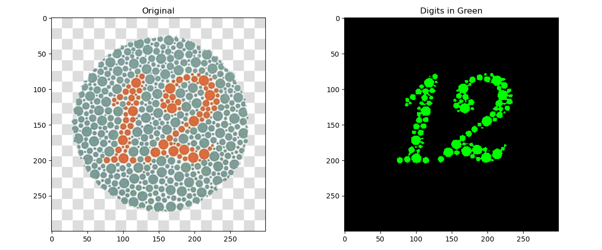

# Green Digit Extractor using Custom K-Means Clustering

This project extracts green-colored digits from images using a custom implementation of the K-Means clustering algorithm. It identifies and highlights green regions in each image based on the LAB color space and saves the output to a separate folder.

## How It Works

1. **Color Space Conversion**: Each image is converted from BGR to LAB color space to access the 'a' channel, which helps distinguish green tones.
2. **Normalization**: The 'a' channel is normalized to standardize pixel intensity for clustering.
3. **Custom K-Means**: A simplified K-Means algorithm clusters the pixel data into two groups.
4. **Green Region Identification**: The cluster with the highest likelihood of representing green is selected (based on cluster center values).
5. **Image Generation**: A new image is generated with only the detected digits highlighted in green on a black background.
6. **Output Saving**: The result is saved in a separate directory called `Results`.

## Folder Structure

```
project/
├── Images/           # Input folder containing images (e.g., .jpg, .png)
├── Results/          # Output folder containing processed images (auto-created)
├── script.py         # Main Python script
└── README.md         # Project description and usage
```

## Requirements

- Python 3.x
- OpenCV (`cv2`)
- NumPy
- Matplotlib

Install the requirements using pip:

```
pip install opencv-python numpy matplotlib
```

## Usage

1. Place all input images inside the `Images/` folder.
2. Run the Python script:

```
python script.py
```

3. Processed images will be saved to the `Results/` folder with filenames prefixed by `green_`.

Example:

## Notes

- This implementation uses a manually written version of K-Means (not `sklearn`).
- Only two clusters are used: one for green digits and the other for background.
- Works best when digits are distinctly green with contrasting background colors.
